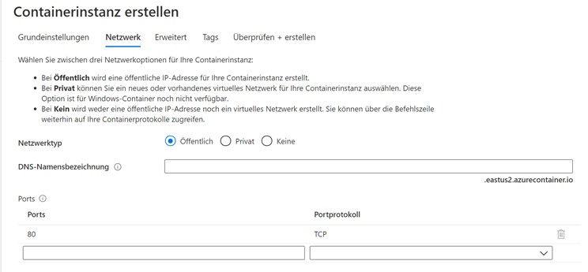

---
wts:
    title: '02 – Bereitstellen von Azure Container Instances'
    module: 'Modul 02 – Core Azure Services'
---

# 02 – Bereitstellen von Azure Container Instances

In dieser exemplarischen Vorgehensweise erstellen, konfigurieren und stellen wir einen Docker-Container mithilfe von Azure Container Instances (ACI) im Azure-Portal bereit. Der Container ist eine „Welcome to ACI“-Webanwendung, die eine statische HTML-Seite anzeigt. 

# Aufgabe 1: Containerinstanz erstellen

In dieser Aufgabe erstellen wir eine neue Containerinstanz für die Webanwendung. 

1. Melden Sie sich beim [Azure-Portal](https://portal.azure.com) an.

2. Suchen Sie auf dem Blatt **Alle Dienste** nach **Container Instances**, und wählen Sie diese Option aus. Klicken Sie anschließend auf **+ Hinzufügen**. 

3. Geben Sie die folgenden grundlegenden Details für die neue Containerinstanz an (belassen Sie die Standardeinstellungen für alles andere so, wie sie sind): 

	| Einstellung| Wert|
	|----|----|
	| Abonnement | **Wählen Sie Ihr Abonnement** |
	| Ressourcengruppe | **myRGContainer** (Neu erstellen) |
	| Containername| **mycontainer**|
	| Region | **(USA) USA, Osten** |
	| Bildquelle| **Docker Hub oder andere Registrierung**|
	| Bildtyp| **Öffentlich**|
	| Bild| **microsoft/aci-helloworld**|
	| BS-Typ:| **Linux** |
	| Größe| ***Belassen Sie die Standardeinstellung***|
	|||

4. Konfigurieren Sie die Registerkarte „Netzwerk“ (ersetzen Sie **xxxx** durch Buchstaben und Ziffern, sodass der Name global eindeutig ist). Belassen Sie für alle anderen Einstellungen die Standardwerte.

	| Einstellung| Wert|
	|--|--|
	| DNS-Namensbezeichnung| **mycontainerdnsxxxx** |
	|||
	
	**Hinweis**: Ihr Container ist unter „dns-name-label.region.azurecontainer.io“ öffentlich erreichbar. Wenn Sie die Fehlermeldung **DNS-Namensbezeichnung nicht verfügbar** nach der Bereitstellung erhalten, geben Sie eine andere DNS-Namensbezeichnung an und stellen Sie sie erneut bereit.

	

5. Klicken Sie auf **Überprüfen + Erstellen**, um den automatischen Validierungsprozess zu starten.

6. Klicken Sie auf **Erstellen**, um die Containerinstanz zu erstellen. 

7. Überwachen Sie die Bereitstellungsseite und die Seite **Benachrichtigungen**. 

8. Während Sie warten, könnten Sie daran interessiert sein, den [Beispielcode hinter dieser einfachen Anwendung](https://github.com/Azure-Samples/aci-helloworld) anzuzeigen. Durchsuchen Sie den Ordner „\App“. 

# Aufgabe 2: Überprüfen Sie die Bereitstellung der Containerinstanz

In dieser Aufgabe überprüfen wir, ob die Containerinstanz ausgeführt wird, indem wir sicherstellen, dass die Willkommensseite angezeigt wird.

1. Klicken Sie nach Abschluss der Bereitstellung auf **Zu Ressource wechseln**, verknüpfen Sie das Blatt „Bereitstellung“ oder die Verknüpfung mit der Ressource im Benachrichtigungsbereich.

2. Stellen Sie im Blatt **Überblick** von **meincontainer** sicher, dass der **Status** Ihres Containers auf **wird ausgeführt** steht. 

3. Suchen Sie den vollqualifizierten Domänennamen (FQDN).

	

2. Kopieren Sie den vollqualifizierten Domänennamen des Containers in das URL-Textfeld des Webbrowsers, und drücken Sie die EINGABETASTE****. Die Startseite sollte angezeigt werden. 

	

**Hinweis**: Sie können auch die Container-IP-Adresse in Ihrem Browser verwenden. 

Herzlichen Glückwunsch! Sie haben Azure-Portal verwendet, um eine Anwendung erfolgreich in einem Container in Azure Containerinstanz bereitzustellen.

**Hinweis**: Um zusätzliche Kosten zu vermeiden, können Sie diese Ressourcengruppe entfernen. Suchen Sie nach Ressourcengruppen, klicken Sie auf Ihre Ressourcengruppe und dann auf **Ressourcengruppe löschen**. Überprüfen Sie den Namen der Ressourcengruppe, und klicken Sie dann auf **Löschen**. Überwachen Sie die **Benachrichtigungen**, um zu sehen, wie der Löschvorgang abläuft.
