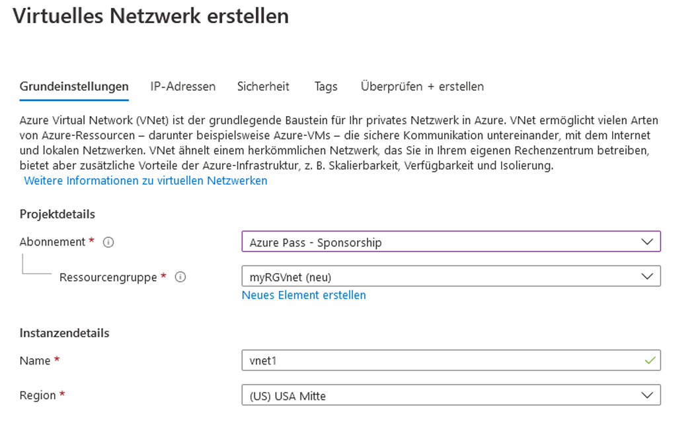
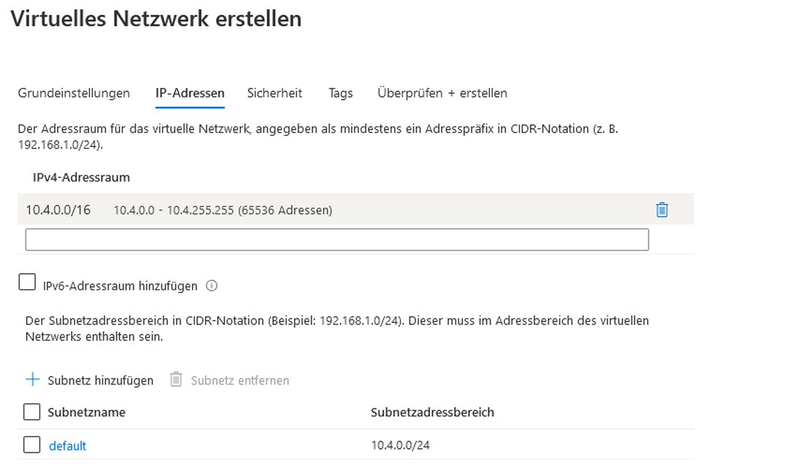

---
wts:
    title: '03 – Erstellen eines virtuellen Netzwerks'
    module: 'Modul 02 – Core Azure Services'
---
# 03 – Erstellen eines virtuellen Netzwerks

In dieser exemplarischen Vorgehensweise erstellen wir ein virtuelles Netzwerk, stellen zwei virtuelle Computer in diesem virtuellen Netzwerk bereit und konfigurieren sie dann so, dass ein virtueller Computer den anderen innerhalb dieses virtuellen Netzwerks pingen kann.

# Aufgabe 1: Erstellen eines virtuellen Netzwerks

In dieser Aufgabe erstellen wir ein virtuelles Netzwerk. 

1. Melden Sie sich beim Azure-Portal an unter: <a href="https://portal.azure.com" target="_blank"><span style="color: #0066cc;" color="#0066cc">https://portal.azure.com</span></a>

2. Suchen Sie auf dem Blatt **Alle Dienste** nach **Virtuelle Netzwerke**, und wählen Sie diese Option aus. Klicken Sie dann auf **+ Hinzufügen**. 

3. Füllen Sie auf dem Blatt **Virtuelles Netzwerk erstellen** die folgenden Werte aus (belassen Sie die Standartwerte für alle anderen Werte):

    | Einstellung | Wert | 
    | --- | --- |
    | Name | **vnet1** |
    | Adressraum |**10.1.0.0/16** |
    | Abonnement | **Wählen Sie Ihr Abonnement** |
    | Ressourcengruppe | **myRGVNet** (Neu erstellen) |
    | Standort | **(USA) USA, Osten** |
    | Subnetzname | **Standard** |
    | Subnetzadressbereich | **10.1.0.0/24** |

    
    

5. Klicken Sie auf die Schaltfläche **Überprüfen + Erstellen**. Stellen Sie sicher, dass die Prüfung erfolgreich ist.

6. Klicken Sie zum Bereitstellen des virtuellen Netzwerks auf die Schaltfläche **Erstellen**. 

    **HINWEIS**: Woher wissen Sie in Ihrem Unternehmen, welche virtuellen Netzwerke und IP-Adressen Sie benötigen?

# Aufgabe 2: Zwei virtuelle Computer erstellen

In dieser Aufgabe erstellen wir zwei virtuelle Computer im virtuellen Netzwerk. 

1. Suchen Sie im Blatt **Alle Dienstleistungen** nach **Virtuelle Computer**, und klicken Sie dann auf **+ Hinzufügen**. 

2. Auf der Registerkarte **Grundlagen** geben Sie die folgenden Informationen ein (belassen Sie ansonsten die Standardeinstellungen):

   | Einstellung | Wert | 
   | --- | --- |
   | Abonnement | **Wählen Sie Ihr Abonnement**  |
   | Ressourcengruppe |  **myRGVNet** |
   | Name des virtuellen Computers | **vm1**|
   | Region | **(USA) USA, Osten** |
   | Bild | **Rechenzentrum für Windows Server 2019** |
   | Benutzername| **azureuser** |
   | Kennwort| **Pa$$w0rd1234** |
   | Öffentliche eingehende Ports| Wählen Sie **Ausgewählte Ports zulassen** aus  |
   | Ausgewählte eingehende Ports| **RDP (3389)** |
   |||

3. Wählen Sie die Registerkarte **Netzwerk** aus. Stellen Sie sicher, dass sich der virtuelle Computer im virtuellen Netzwerk „vnet1“ befindet. Überprüfen Sie die Standardeinstellungen, nehmen Sie jedoch keine weiteren Änderungen vor. 

   | Einstellung | Wert | 
   | --- | --- |
   | Virtuelles Netzwerk | **vnet1** |
   |||

4. Klicken Sie auf **Überprüfen + Erstellen**. Klicken Sie nach Abschluss der Validierung auf **Erstellen**. Die Bereitstellungszeiten können variieren, die Bereitstellung kann jedoch im Allgemeinen zwischen drei und sechs Minuten dauern.

5. Überwachen Sie Ihre Bereitstellung, fahren Sie jedoch mit dem nächsten Schritt fort. 

6. Erstellen Sie einen zweiten virtuellen Computer, indem Sie die oben genannten Schritte **2 bis 4** wiederholen. Stellen Sie sicher, dass Sie einen anderen Namen für den virtuellen Computer verwenden, dass sich der virtuellen Computer im selben virtuellen Netzwerk befindet und eine neue öffentliche IP-Adresse verwendet:

    | Einstellung | Wert |
    | --- | --- |
    | Ressourcengruppe | **myRGVNet** |
    | Name des virtuellen Computers |  **vm2** |
    | Virtuelles Netzwerk | **vnet1** |
    | Öffentliche IP-Adresse | (neu) **vm2-ip** |
    |||

7. Warten Sie, bis beide virtuellen Computer bereitgestellt sind. 

# Aufgabe 3: Verbindung testen 

In dieser Aufgabe werden wir ICMP-Verbindungen zulassen und testen, ob die Virtual Machines miteinander kommunizieren (pingen) können. 

1. Suchen Sie im Blatt **Alle Ressourcen** nach **vm1**, öffnen Sie das zugehörige Blatt **Übersicht** und stellen Sie sicher, dass das Blatt **Status** **Laufend** anzeigt. Möglicherweise müssen Sie die Seite **Aktualisieren**.

2. Klicken Sie auf dem Blatt **Überblick** auf die Schaltfläche **Verbinden**.

    **HINWEIS**: In den folgenden Anweisungen erfahren Sie, wie Sie von einem Windows-Computer aus eine Verbindung zu Ihrem virtuellen Computer herstellen. 

3. Behalten Sie auf dem Blatt **Verbindung mit virtueller Maschine herstellen** die Standardoptionen für die Verbindung per IP-Adresse über Port 3389 bei, und klicken Sie auf **RDP-Datei herunterladen**.

4. Öffnen Sie die heruntergeladene RDP-Datei und klicken Sie auf **Verbinden**, wenn Sie dazu aufgefordert werden. 

5. Geben Sie im Fenster **Windows-Sicherheit** den Benutzernamen **azureuser** und das Kennwort **Pa$$w0rd1234** ein, und klicken Sie dann auf **OK**.

6. Möglicherweise erhalten Sie während des Anmeldevorgangs eine Zertifikatwarnung. Klicken Sie auf **Ja**, um die Verbindung herzustellen und eine Verbindung zu Ihrem bereitgestellten virtuellen Computer herzustellen. Sie sollten erfolgreich eine Verbindung herstellen.

7. Öffnen Sie eine PowerShell-Eingabeaufforderung auf dem virtuellen Computer, indem Sie auf die Schaltfläche **Start** klicken, **PowerShell** eingeben, mit der rechten Maustaste auf **Windows PowerShell** im Rechtsklickmenü klicken und auf **Als Administrator ausführen** klicken.

8. Versuchen Sie, vm2 zu pingen (stellen Sie sicher, dass vm2 ausgeführt wird). Sie erhalten eine Fehlermeldung, dass das Zeitlimit für die Anforderung abgelaufen ist.  Der Ping schlägt fehl, weil Ping das **ICMP (Internet Control Message Protocol)** verwendet. Standardmäßig wird ICMP durch die Windows-Firewall nicht zugelassen.


   ```PowerShell
   ping vm2
   ```
   
   

    **HINWEIS**: Sie öffnen jetzt eine RDP-Sitzung für vm2 und lassen eingehende ICMP-Verbindungen zu.

9. Stellen Sie mithilfe von RDP eine Verbindung mit **vm2** her. Sie können die Schritte **2 bis 6** ausführen.

10. Öffnen Sie eine **PowerShell**-Eingabeaufforderung, und lassen Sie ICMP zu. Dieser Befehl erlaubt eingehende ICMP-Verbindungen über die Windows-Firewall.

   ```PowerShell
   New-NetFirewallRule –DisplayName “Allow ICMPv4-In” –Protocol ICMPv4
   ```
   

   **HINWEIS**: Sie wechseln jetzt zur RDP-Sitzung zu VM1 und versuchen den Ping erneut

11. Kehren Sie zur RDP-Sitzung zu vm1 zurück und versuchen Sie den Ping erneut. Sie sollten jetzt erfolgreich sein. 

   ```PowerShell
   ping vm2
   ```

Herzlichen Glückwunsch! Sie haben zwei virtuelle Computer in einem virtuellen Netzwerk konfiguriert und bereitgestellt. Sie haben auch die Windows-Firewall so konfiguriert, dass einer der virtuellen Computer eingehende Ping-Anforderungen zulässt. 

**HINWEIS**: Um zusätzliche Kosten zu vermeiden, können Sie diese Ressourcengruppe entfernen. Suchen Sie nach Ressourcengruppen, klicken Sie auf Ihre Ressourcengruppe und dann auf **Ressourcengruppe löschen**. Überprüfen Sie den Namen der Ressourcengruppe und klicken Sie dann auf **Löschen**. Überwachen Sie die **Benachrichtigungen**, um zu sehen, wie der Löschvorgang abläuft.
