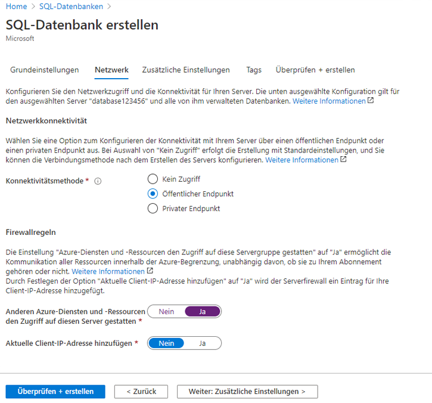
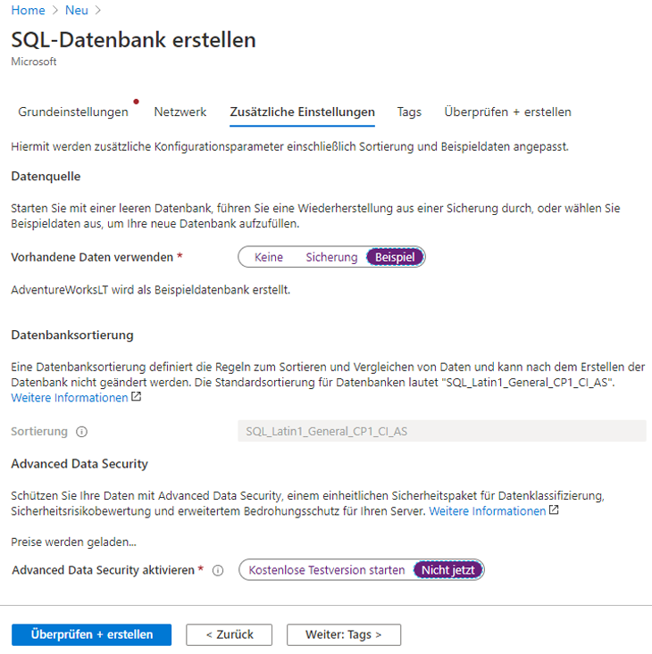
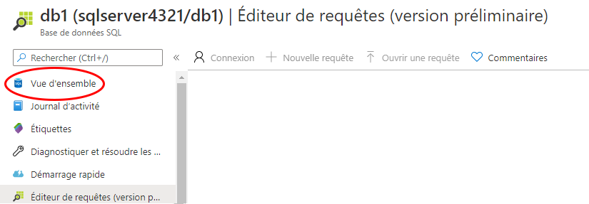

---
wts:
    title: '05 – Erstellen einer SQL-Datenbank'
    module: 'Modul 02 – Core Azure Services'
---

# 05 – Erstellen einer SQL-Datenbank

In dieser exemplarischen Vorgehensweise erstellen wir eine SQL-Datenbank in Azure und fragen dann die Daten in dieser Datenbank ab.

# Aufgabe 1: Erstellen der Datenbank

In dieser Aufgabe werden wir eine SQL-Datenbank auf der Grundlage der AdventureWorksLT-Beispieldatenbank erstellen. 

1. Melden Sie sich beim Azure-Portal an unter [**https://portal.azure.com**](https://portal.azure.com).

2. Suchen Sie im Blatt **Alle Dienste** nach **SQL-Datenbanken** und wählen Sie es aus. Klicken Sie dann auf **+ Hinzufügen**. 

3. Geben Sie auf der Registerkarte **Grundlagen** diese Informationen ein.  

    | Einstellung | Wert | 
    | --- | --- |
    | Abonnement | **Wählen Sie Ihr Abonnement** |
    | Ressourcengruppe | **myRGDb** (Neu erstellen) |
    | Datenbankname| **db1** | 
    | | |

3. Klicken Sie neben der Dropdownliste **Server** auf **Neu erstellen**, und geben Sie diese Informationen ein (ersetzen Sie **xxxx** im Servernamen durch Buchstaben und Ziffern, sodass der Name global eindeutig ist). Klicken Sie auf **OK**, wenn Sie fertig sind.

    | Einstellung | Wert | 
    | --- | --- |
    | Servername | **sqlserverxxxx** (muss eindeutig sein) | 
    | Serveradministratoranmeldung | **sqluser** |
    | Kennwort | **Pa$$w0rd1234** |
    | Ort | **(USA) USA, Osten** |
    | Azure-Diensten Zugriff auf den Server erlauben| ***Aktivieren Sie das Kontrollkästchen*** |
    | | |

   

4. Wechseln Sie auf die Registerkarte **Netzwerk**, und konfigurieren Sie die folgenden Einstellungen (lassen Sie andere mit ihren Standardeinstellungen). 

    | Einstellung | Wert | 
    | --- | --- |
    | Konnektivitätsmethode | **Öffentlicher Endpunkt** |    
    | Ermöglichen Sie Azure-Diensten und -Ressourcen den Zugriff auf diesen Server | **Ja** |
    | Aktuelle Client-IP-Adresse hinzufügen | **Nein** |
    | | |
    
   

5. Wechseln Sie in die Registerkarte **Zusätzliche Einstellungen**. Wir werden die AdventureWorksLT-Beispieldatenbank verwenden.

    | Einstellung | Wert | 
    | --- | --- |
    | Vorhandene Daten verwenden | **Stichprobe** |
    | Sortierung | ***Standard verwenden*** |
    | Advanced Data Security aktivieren | **Nicht jetzt** |
    | | |

    

6. Klicken Sie auf **Überprüfen + Erstellen** und dann auf **Erstellen**, um die Ressourcengruppe, den Server und die Datenbank bereitzustellen. Die Bereitstellung kann etwa 2 bis 5 Minuten dauern.

7. Überwachen Sie Ihre Bereitstellung. 

# Aufgabe 2: Datenbank testen.

In dieser Aufgabe konfigurieren wir den SQL Server und führen eine SQL-Abfrage aus. 

1. Suchen Sie auf dem Blatt **Alle Dienste** nach **SQL-Datenbanken**, und wählen Sie diese Option aus. Vergewissern Sie sich, dass Ihre neue Datenbank erstellt wurde. Möglicherweise müssen Sie die Seite **Aktualisieren**.

    

2. Klicken Sie auf den Eintrag **db1**, der die von Ihnen erstellte SQL-Datenbank darstellt, und klicken Sie dann auf **Abfrage-Editor (Vorschau)**.

3. Melden Sie sich als **sqluser** mit dem Kennwort **Pa$$$w0rd1234** an.

4. Sie werden sich nicht anmelden können. Lesen Sie den Fehler genau durch und notieren Sie sich die IP-Adresse, die durch die Firewall erlaubt werden muss. 

    

5. Klicken Sie im Blatt **db1** auf **Überblick**. 

    

6. Klicken Sie im SQL-Server-Blatt **Überblick** auf **Server-Firewall einstellen**.

7. Klicken Sie auf **Client-IP hinzufügen** (obere Menüleiste), um die IP-Adresse hinzuzufügen, auf die in der Fehlermeldung verwiesen wird. Achten Sie darauf, Ihre Änderungen zu **Speichern**. 

    

8. Kehren Sie zu Ihrer SQL-Datenbank und der Anmeldeseite von **Abfrage-Editor (Vorschau)** zurück. Versuchen Sie, sich wieder als **sqluser** mit dem Kennwort **Pa$$$w0rd1234** anzumelden. Diesmal sollten Sie Erfolg haben. Beachten Sie, dass es einige Minuten dauern kann, bis die neue Firewall-Regel bereitgestellt wird. 

9. Sobald Sie sich erfolgreich angemeldet haben, wird das Abfragefenster angezeigt. Geben Sie die folgende Abfrage in den Editor-Bereich ein.

    ```SQL
    SELECT TOP 20 pc.Name as CategoryName, p.name as ProductName
    FROM SalesLT.ProductCategory pc
    JOIN SalesLT.Product p
    ON pc.productcategoryid = p.productcategoryid;
    ```

    

10. Klicken Sie auf **Ausführen**, und überprüfen Sie dann die Abfrageergebnisse im Bereich **Ergebnisse**. Die Abfrage sollte erfolgreich ausgeführt werden.

    

Herzlichen Glückwunsch! Sie haben eine SQL-Datenbank in Azure erstellt und die Daten in dieser Datenbank erfolgreich abgefragt.

**Hinweis**: Um zusätzliche Kosten zu vermeiden, können Sie diese Ressourcengruppe entfernen. Suchen Sie nach Ressourcengruppen, klicken Sie auf Ihre Ressourcengruppe und dann auf **Ressourcengruppe löschen**. Überprüfen Sie den Namen der Ressourcengruppe, und klicken Sie dann auf **Löschen**. Überwachen Sie die **Benachrichtigungen**, um zu sehen, wie der Löschvorgang abläuft.
