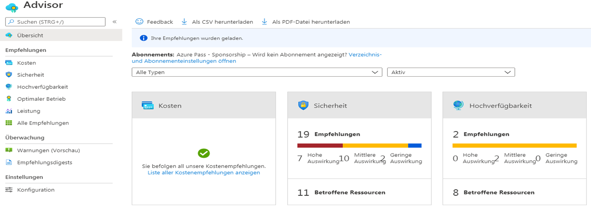
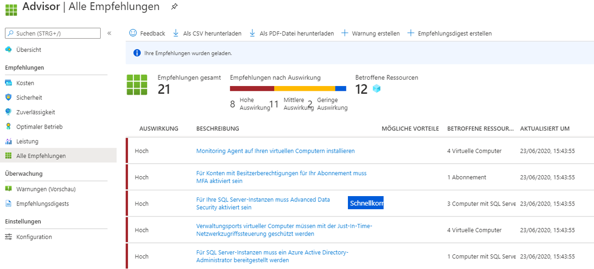

---
wts:
    title: '10 – Einen virtuellen Computer mithilfe von PowerShell erstellen'
    module: 'Modul 02 – Core Azure Services'
---
# 10 – Erstellen eines virtuellen Computers mithilfe von PowerShell

In dieser exemplarischen Vorgehensweise konfigurieren wir die Cloud Shell, erstellen mithilfe des Azure PowerShell-Moduls eine Ressourcengruppe und einen virtuellen Computer und überprüfen die Empfehlungen von Azure Advisor. 

# Aufgabe 1: Die Cloud Shell konfigurieren

In dieser Aufgabe konfigurieren wir Cloud Shell. 

1. Melden Sie sich beim [Azure-Portal](https://portal.azure.com) an.

2. Öffnen Sie im Azure-Portal die Option **Azure Cloud Shell**, indem Sie auf das Symbol oben rechts im Azure-Portal klicken.

    

3. Wenn Sie die Cloud Shell bereits verwendet haben, fahren Sie mit der nächsten Aufgabe fort. 

4. Wenn Sie aufgefordert werden, entweder **Bash** oder **PowerShell** auszuwählen, wählen Sie **PowerShell** aus. 

5. Wenn Sie dazu aufgefordert werden, klicken Sie auf **Speicher erstellen**, und warten Sie, bis die Azure Cloud Shell initialisiert ist. 

# Aufgabe 2: Erstellen einer Ressourcengruppe und eines virtuellen Computers

In dieser Übung erstellen Sie mithilfe von PowerShell eine Ressourcengruppe und einen virtuellen Computer.  

1. Stellen Sie sicher, dass **PowerShell** im Dropdownmenü oben links im Cloud Shell-Bereichs ausgewählt ist.

2. Erstellen Sie in der PowerShell-Sitzung im Cloud Shell-Bereich eine neue Ressourcengruppe. 

    ```PowerShell
    New-AzResourceGroup -Name myRGPS -Location EastUS
    ```

3. Überprüfen Sie Ihre neue Ressourcengruppe. 

    ```PowerShell
    Get-AzResourceGroup | Format-Table
    ```

4. Erstellen Sie einen virtuellen Computer. Wenn Sie dazu aufgefordert werden, geben Sie den Benutzernamen (**azureuser**) und das Kennwort (**Pa$$w0rd1234**) an, die als lokales Administratorkonto auf diesen virtuellen Computern konfiguriert werden. Stellen Sie sicher, dass Sie die Häkchen (`) am Ende jeder Zeile mit Ausnahme des letzten Häkchens einfügen (es sollten keine Häkchen vorhanden sein, wenn Sie den gesamten Befehl in eine einzige Zeile eingeben).

    ```PowerShell
    New-AzVm `
    -ResourceGroupName "myRGPS" `
    -Name "myVMPS" `
    -Location "East US" `
    -VirtualNetworkName "myVnetPS" `
    -SubnetName "mySubnetPS" `
    -SecurityGroupName "myNSGPS" `
    -PublicIpAddressName "myPublicIpPS"
    ```

5. Schließen Sie den Cloud Shell-Bereich der PowerShell-Sitzung.

6. Suchen Sie im Azure-Portal nach **Virtuelle Computer**, und überprüfen Sie, ob **myVMPS** ausgeführt wird. Dies kann einige Minuten dauern.

    

7. Greifen Sie auf den neuen virtuellen Computer zu, und überprüfen Sie die Einstellungen für „Übersicht“ und „Netzwerk“, um sicherzustellen, dass Ihre Informationen korrekt bereitgestellt wurden. 

# Aufgabe 3: Befehle in Cloud Shell ausführen

In dieser Aufgabe üben wir das Ausführen von PowerShell-Befehlen aus der Cloud Shell. 

1. Öffnen Sie im Azure-Portal die Option **Azure Cloud Shell**, indem Sie auf das Symbol oben rechts im Azure-Portal klicken.

2. Stellen Sie sicher, dass **PowerShell** im Dropdownmenü oben links im Cloud Shell-Bereichs ausgewählt ist.

3. Rufen Sie Informationen zu Ihrem virtuellen Computer ab, einschließlich Name, Ressourcengruppe, Standort und Status. Beachten Sie, dass PowerState **ausgeführt wird**.

    ```PowerShell
    Get-AzVM -name myVMPS -status | Format-Table -autosize
    ```

4. Halten Sie den virtuellen Computer an. Wenn Sie dazu aufgefordert werden, bestätigen Sie die Aktion (Ja). 

    ```PowerShell
    Stop-AzVM -ResourceGroupName myRGPS -Name myVMPS
    ```

5. Überprüfen Sie den Status Ihres virtuellen Computers. Die Energiestatus-Zuordnung sollte jetzt **aufgehoben** sein. Sie können den Status des virtuellen Computers auch im Portal überprüfen. 

    ```PowerShell
    Get-AzVM -name myVMPS -status | Format-Table -autosize
    ```

# Aufgabe 4: Azure Advisor-Empfehlungen überprüfen

**Hinweis:** Diese Aufgabe finden Sie im Lab „Erstellen eines virtuellen Computers mit der Azure CLI“. 

In dieser Aufgabe überprüfen wir die Azure Advisor-Empfehlungen für unseren virtuellen Computer. 

1. Suchen Sie auf Blatt **Alle Dienste** nach **Advisor**, und wählen Sie diese Option aus. 

2. Wählen Sie im Blatt **Advisor** den Eintrag **Überblick** aus. Beachten Sie, dass Empfehlungen nach Hochverfügbarkeit, Sicherheit, Leistung und Kosten gruppiert sind. 

    

3. Wählen Sie **Alle Empfehlungen** aus und Sie sich Zeit, um die einzelnen Empfehlungen und vorgeschlagenen Maßnahmen anzuzeigen. 

    **Hinweis:** Die Empfehlungen sind je nach Ihren Ressourcen unterschiedlich. 

    

4. Beachten Sie, dass Sie die Empfehlungen als CSV- oder PDF-Datei herunterladen können. 

5. Beachten Sie, dass Sie Warnungen erstellen können. 

6. Wenn Sie Zeit haben, experimentieren Sie weiter mit Azure PowerShell. 

Herzlichen Glückwunsch! Sie haben Cloud Shell konfiguriert, mithilfe von PowerShell einen virtuellen Computer erstellt, PowerShell-Befehle geübt und Advisor-Empfehlungen angesehen.

**Hinweis**: Um zusätzliche Kosten zu vermeiden, können Sie diese Ressourcengruppe entfernen. Suchen Sie nach Ressourcengruppen, klicken Sie auf Ihre Ressourcengruppe und dann auf **Ressourcengruppe löschen**. Überprüfen Sie den Namen der Ressourcengruppe, und klicken Sie dann auf **Löschen**. Überwachen Sie die **Benachrichtigungen**, um zu sehen, wie der Löschvorgang abläuft.
