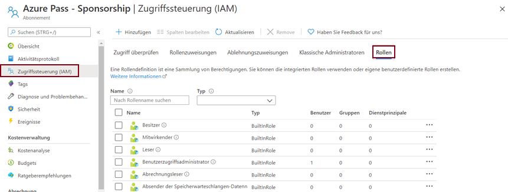
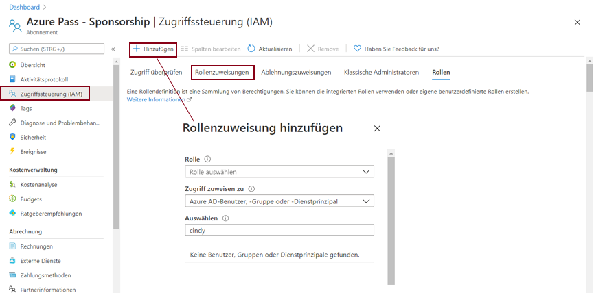

---
wts:
    title: '15 – Zugriff mit RBAC verwalten'
    module: 'Modul 03 – Sicherheit, Datenschutz, Compliance und Vertrauen'
---
# 15 – Verwalten des Zugriffs mit RBAC

In dieser exemplarischen Vorgehensweise werden wir Rollen zuweisen und Aktivitätsprotokolle anzeigen. 

# Aufgabe 1: Anzeigen und Zuweisen von Rollen

In dieser Aufgabe weisen wir die Rolle „Mitwirkender für virtuelle Computer“ zu. 

1. Melden Sie sich beim [Azure-Portal](https://portal.azure.com) an.

2. Suchen Sie auf dem Blatt **Alle Dienste** nach **Ressourcengruppen**, und wählen Sie diese Option aus. Klicken Sie anschließend auf **+ Hinzufügen**.

3. Erstellen Sie eine neue Ressourcengruppe. Klicken Sie auf **Erstellen**, wenn Sie fertig sind. 

    | Einstellung | Wert |
    | -- | -- |
    | Abonnement | **Wählen Sie Ihr Abonnement** |
    | Ressourcengruppe | **myRGRBAC** |
    | Region | **(USA) USA, Osten** |
    | | |

4. Erstellen Sie **Überprüfen + Erstellen**, und klicken Sie dann auf **Erstellen**.

5. **Aktualisieren** Sie die Seite „Ressourcengruppe“, und klicken Sie auf den Eintrag, der die neu erstellte Ressourcengruppe darstellt.

6. Klicken Sie auf das Blatt **Zugriffssteuerung (IAM)**, und wechseln Sie dann auf die Registerkarte **Rollen**. Blättern Sie durch die große Anzahl an Rollendefinitionen, die verfügbar sind. Verwenden Sie die Informationssymbole, um eine Vorstellung von den Berechtigungen der einzelnen Rollen zu erhalten. Beachten Sie, dass es auch Informationen zur Anzahl der Benutzer und Gruppen gibt, die jeder Rolle zugewiesen sind.

    

7. Wechseln Sie zur Registerkarte **Rollenzuweisungen** des Blattes **myRGRBAC - Zugriffssteuerung (IAM)**, klicken Sie auf **Hinzufügen** und dann auf **Rollenzuweisung hinzufügen**. Weisen Sie Ihrem Benutzerkonto die Rolle „Mitwirkender für virtuelle Computer“ zu, und klicken Sie dann auf **Speichern**. 

    | Einstellung | Wert |
    | -- | -- |
    | Rolle | **Mitwirkender für virtuelle Computer** |
    | Zugriff zuweisen | **Azure AD-Benutzer, -Gruppe oder -Dienstprinzipal** |
    | Auswählen | Ihr Benutzerkonto |
    | | |

    **Hinweis:** Mit der Rolle des Mitwirkenden für virtuelle Computer können Sie virtuelle Computer verwalten, jedoch nicht auf deren Betriebssystem zugreifen oder das virtuelle Netzwerk und das Speicherkonto verwalten, mit denen sie verbunden sind.

    

8.  **Aktualisieren** Sie die Seite „Rollenzuweisungen“ und stellen Sie sicher, dass Sie jetzt als Mitwirkender eines virtuellen Computers aufgeführt sind. 

    **Hinweis**: Diese Zuweisung gewährt Ihnen keine zusätzlichen Berechtigungen, da Ihr Konto bereits über die Besitzerrolle verfügt, die alle mit der Teilnehmerrolle verbundenen Berechtigungen enthält.

# Aufgabe 2: Rollenzuweisungen überwachen und eine Rolle entfernen

In dieser Aufgabe überprüfen wir anhand des Aktivitätsprotokolls die Rollenzuweisung entfernen anschließend die Rolle. 

1. Klicken Sie auf dem Blatt „myRGRBAC Ressourcengruppen“ auf **Aktivitätsprotokoll**.

2. Klicken Sie auf **Filter hinzufügen**, wählen Sie **Vorgang** und dann **Rollenzuweisung erstellen** aus.

    

3. Überprüfen Sie, ob Ihre Rollenzuweisung im Aktivitätsprotokoll angezeigt wird. 

    **Hinweis**: Wissen Sie, wie Sie Ihre Rollenzuweisung entfernen können?

Herzlichen Glückwunsch! Sie haben Rollen zugewiesen und Aktivitätsprotokolle angezeigt. 

**Hinweis**: Um zusätzliche Kosten zu vermeiden, können Sie diese Ressourcengruppe entfernen. Suchen Sie nach Ressourcengruppen, klicken Sie auf Ihre Ressourcengruppe und dann auf **Ressourcengruppe löschen**. Überprüfen Sie den Namen der Ressourcengruppe, und klicken Sie dann auf **Löschen**. Überwachen Sie die **Benachrichtigungen**, um zu sehen, wie der Löschvorgang abläuft.

